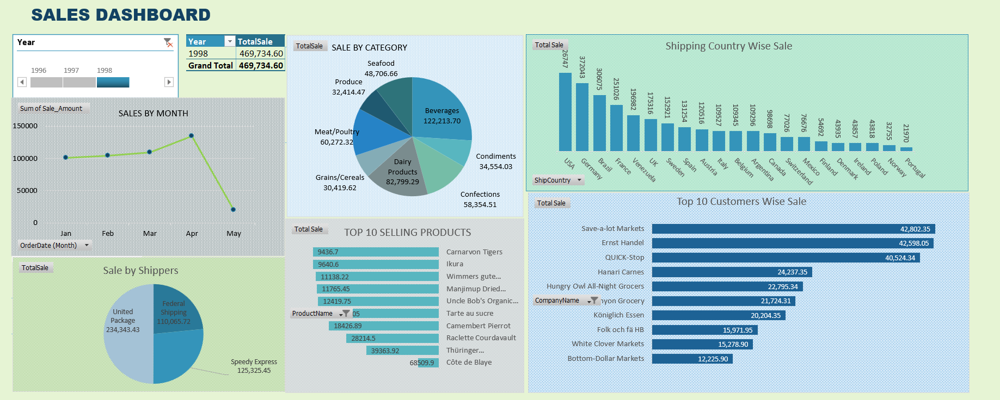
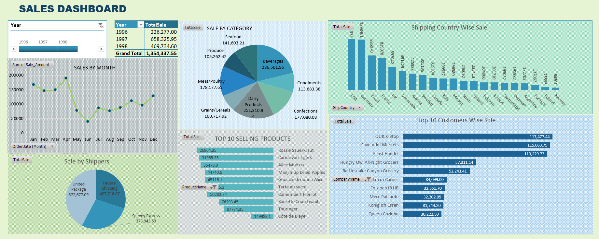

# Excel Sales Dashboard

This project contains an interactive Excel-based sales dashboard built from multiple related tables such as Orders, Customers, Products, Shippers, and Regions. The dashboard allows users to analyze sales performance by year, month, product category, shipping method, country, and customer segment.

## Dataset and Tools

- Tool: Microsoft Excel (PivotTables, charts, slicers)
- Data model: Separate tables for orders, customers, products, shippers, regions, etc., linked through common keys
- Visuals: PivotCharts, line chart, pie charts, bar charts

## Dashboard Features

1 Year slicer that updates all charts and summary values
2 Sales by Month line chart to view trends within the selected year
3 Sales by Category pie chart to understand category-wise contribution
4 Sales by Shippers pie chart to compare shipping performance
5 Country-wise Sales bar chart to see which countries generate the most revenue
6 Top 10 Selling Products section to highlight best-performing items
7 Top 10 Customers bar chart to identify key customers

## Dashboard Snaoshot
### Sales Dashboard – Single Year View (1998)

### Sales Dashboard – For all Years View (1996 - 1998)

